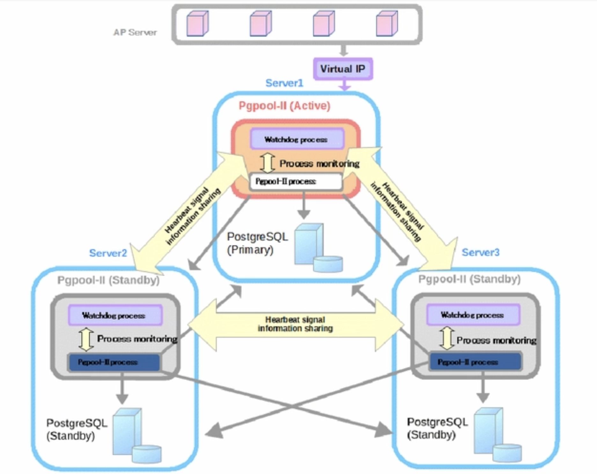
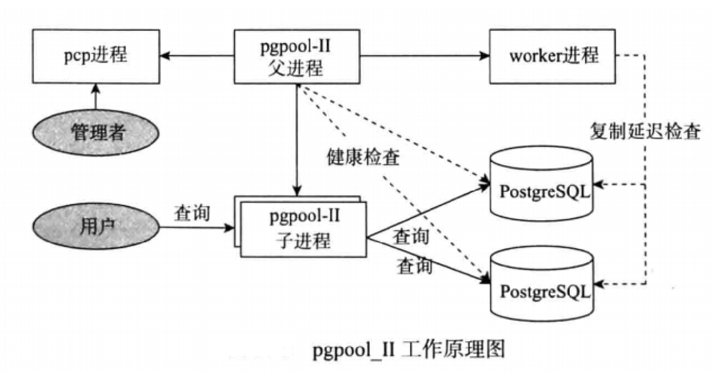

# pgpool-II 是什么
pgpool-II 是一个用于 PostgreSQL 数据库的中间件，它位于 PostgreSQL 服务器和 PostgreSQL 数据库客户端之间，充当代理。pgpool-II能提供了较多的功能，能提高数据库的性能、可用性和可管理性。

# pgpool-II 能做什么
pgpool-II是一个功能强大的中间件，以pgpool-II 4.3.7为例，具有以下关键特性：
- 高可用（High Availability）：Pgpool-II 通过使用多个 PostgreSQL 服务器提供高可用性（HA）功能，可以自动从服务器池中删除故障的服务器以继续执行数据库任务。提供自动故障切换功能。
- 负载均衡（Load Balance）：
它分配客户端查询到多个 PostgreSQL 服务器，以平衡负载，确保没有单个服务器成为瓶颈。这可以提高数据库系统的整体吞吐量和响应时间。
- 连接池（Connection Pooling）：pgpool-II有助于管理到 PostgreSQL 服务器的数据库连接池。通过重用现有连接，减少为每个客户端建立新连接的开销，从而提高性能。
-  在线恢复（Online Recovery）：Pgpool-II 可以通过执行一个命令对数据库节点进行在线恢复。当在线恢复与自动故障切换一起使用时，通过故障切换分离的节点可以自动附加为备用节点。
-  限制连接（Limiting Exceeding Connections）：对于 PostgreSQL数据库具有最大的连接限制值，当达到此数量时时，新的连接将被拒绝。PostgreSQL承接较多的连接数会增加资源消耗，并对数据库整体系统性能产生负面影响。pgpool-II 可以限制最大的连接数，限制期间新的连接会进入到队列里面进行等待而不是给客户端立即返回错误。
-  监视器（Watchdog）：Watchdog 可以协调多个 Pgpool-II，创建一个强大的集群系统，并避免单点故障或分裂脑。为了避免分裂脑，至少需要 3 个 Pgpool-II 节点。Watchdog 可以执行与其他 pgpool-II 节点的生命检查，以检测 Pgpool-II 的故障。如果活跃的 Pgpool-II 崩溃，备用的 Pgpool-II 可以被提升为活动状态。
-  内存中查询缓存（In Memory Query Cache）：内存中查询缓存允许保存 SELECT 语句及其结果。如果出现相同的 SELECT查询，Pgpool-II 将从缓存中返回值。由于不涉及 SQL 解析或访问 PostgreSQL，使用内存缓存非常快。

# pgpool-II 概念图
pgpool-II子进程：接受 发送sql

Work进程：检查延迟情况。

Health Check：检查pg存活状态进程




# pgpool-II 工作进程
pgpool-II 的服务进程。

pcp进程：向pgpool发送管理命令的

pgpool-II父进程：负责检查数据库健康

pgpool-II子进程：接受 发送sql

work进程：检查延迟情况。

pgpool logger：记录日志

health Check：检查pg存活状态进程



# pgpool-II 安装使用
## pgpool-II下载地址
```
https://www.pgpool.net/yum/rpms/4.3/redhat/rhel-7-x86_64/
```

```
-- 查看已下载的包
# ll
total 4468
-rw-r--r-- 1 root root 1781552 Dec 29 14:21 pgpool-II-pg12-4.3.7-1pgdg.rhel7.x86_64.rpm
-rw-r--r-- 1 root root   18976 Dec 29 14:21 pgpool-II-pg12-devel-4.3.7-1pgdg.rhel7.x86_64.rpm
-rw-r--r-- 1 root root   49544 Dec 29 14:21 pgpool-II-pg12-extensions-4.3.7-1pgdg.rhel7.x86_64.rpm

-- 安装pgpool-II
# rpm -ivh pgpool-II-pg12-4.3.7-1pgdg.rhel7.x86_64.rpm
warning: pgpool-II-pg12-4.3.7-1pgdg.rhel7.x86_64.rpm: Header V4 RSA/SHA256 Signature, key ID f153bfd6: NOKEY
Preparing...                          ################################# [100%]
Updating / installing...
   1:pgpool-II-pg12-4.3.7-1pgdg.rhel7 ################################# [100%]
   
# rpm -ivh pgpool-II-pg12-devel-4.3.7-1pgdg.rhel7.x86_64.rpm
warning: pgpool-II-pg12-devel-4.3.7-1pgdg.rhel7.x86_64.rpm: Header V4 RSA/SHA256 Signature, key ID f153bfd6: NOKEY
Preparing...                          ################################# [100%]
Updating / installing...
   1:pgpool-II-pg12-devel-4.3.7-1pgdg.################################# [100%]
   
# rpm -ivh pgpool-II-pg12-extensions-4.3.7-1pgdg.rhel7.x86_64.rpm
warning: pgpool-II-pg12-extensions-4.3.7-1pgdg.rhel7.x86_64.rpm: Header V4 RSA/SHA256 Signature, key ID f153bfd6: NOKEY
Preparing...                          ################################# [100%]
Updating / installing...
   1:pgpool-II-pg12-extensions-4.3.7-1################################# [100%]
```

## 编辑配置文件
```
cat   /etc/pgpool-II/pgpool.conf|grep -v "^#"|grep -v "#"|grep -v  '^$'

backend_clustering_mode = 'streaming_replication'
listen_addresses = '*'
port = 9999
socket_dir = '/tmp'
pcp_listen_addresses = '*'
pcp_port = 9898
-- pcp_socket_dir 需要修改成tmp
pcp_socket_dir = '/tmp'
listen_backlog_multiplier = 2
serialize_accept = off
-- 以下为连接数据库的配置
backend_hostname0 = '127.0.0.1'
backend_port0 = 5432
backend_weight0 = 1
backend_data_directory0 = '/mxdata_20231214191900/master/mxseg-1'
backend_flag0 = 'ALLOW_TO_FAILOVER'
backend_application_name0 = 'server0'
enable_pool_hba = off
pool_passwd = 'pool_passwd'
authentication_timeout = 1min
num_init_children = 32
max_pool = 4
child_life_time = 5min
child_max_connections = 0
connection_life_time = 0
client_idle_limit = 0
log_destination = 'stderr'
log_connections = off
log_disconnections = off
log_hostname = off
log_statement = on
log_per_node_statement = off
log_client_messages = off
syslog_facility = 'LOCAL0'
syslog_ident = 'pgpool'
logging_collector = on
log_directory = '/var/log/pgpool_log'
log_filename = 'pgpool-%a.log'
log_truncate_on_rotation = on
log_rotation_age = 1d
log_rotation_size = 0
pid_file_name = '/var/run/pgpool/pgpool.pid'
-- logdir 需要修改成tmp
logdir = '/tmp'
connection_cache = on
reset_query_list = 'ABORT; DISCARD ALL'
replicate_select = off
insert_lock = off
lobj_lock_table = ''
replication_stop_on_mismatch = off
failover_if_affected_tuples_mismatch = off
load_balance_mode = on
ignore_leading_white_space = on
read_only_function_list = ''
write_function_list = ''
primary_routing_query_pattern_list = ''
health_check_period = 0
health_check_timeout = 20
health_check_user = 'nobody'
health_check_password = ''
health_check_database = ''
health_check_max_retries = 0
health_check_retry_delay = 1
connect_timeout = 10000
recovery_user = 'nobody'
recovery_password = ''
recovery_1st_stage_command = ''
recovery_2nd_stage_command = ''
recovery_timeout = 90
client_idle_limit_in_recovery = 0
auto_failback = off
auto_failback_interval = 1min
use_watchdog = off
trusted_servers = ''
ping_path = '/bin'
hostname0 = ''
wd_port0 = 9000
pgpool_port0 = 9999
wd_ipc_socket_dir = '/var/run/postgresql'
delegate_IP = ''
if_cmd_path = '/sbin'
if_up_cmd = '/usr/bin/sudo /sbin/ip addr add $_IP_$/24 dev eth0 label eth0:0'
if_down_cmd = '/usr/bin/sudo /sbin/ip addr del $_IP_$/24 dev eth0'
arping_path = '/usr/sbin'
arping_cmd = '/usr/bin/sudo /usr/sbin/arping -U $_IP_$ -w 1 -I eth0'
clear_memqcache_on_escalation = on
wd_escalation_command = ''
wd_de_escalation_command = ''
wd_life_point = 3
wd_lifecheck_query = 'SELECT 1'
wd_lifecheck_dbname = 'template1'
wd_lifecheck_user = 'nobody'
wd_lifecheck_password = ''
relcache_expire = 0
relcache_size = 256
check_temp_table = catalog
check_unlogged_table = on
enable_shared_relcache = on
-- 以下参数需要开启
memory_cache_enabled = on
memqcache_method = 'shmem'
memqcache_memcached_host = 'localhost'
memqcache_memcached_port = 11211
memqcache_total_size = 2048MB
memqcache_max_num_cache = 1000000
memqcache_expire = 0
memqcache_auto_cache_invalidation = on
memqcache_maxcache = 10MB
memqcache_cache_block_size = 50MB
memqcache_oiddir = '/var/log/pgpool/oiddir'
cache_safe_memqcache_table_list = 'test,test1'
cache_unsafe_memqcache_table_list = ''
```


# pgpool-II 查询缓存案例
        Pgpool-II允许缓存读取的查询结果，这将为多次发出相同读取查询的应用程序带来巨大的好处。如果有两个查询并且查询字符串相同，则两个查询被视为等价，并进行缓存。第一次发送查询时，Pgpool-II会保存查询的结果，并将其用于第二次查询，
    修改表时，针对该表的查询结果可能会更改。为了避免不一致，当相应的表被修改时，Pgpool-II会丢弃查询缓存数据。所以频繁更新的数据库将不适合在内存中使用查询缓存。

## 开启pgpool 
> 以下需要使用root用户执行
```
-- 创建软连接
ln -s /usr/local/greenplum/lib/libpq.so.5 /usr/lib64/libpq.so.5 

-- 创建socket文件目录
mkdir -p /var/log/pgpool/oiddir
chown -R gpadmin:gpadmin /var/log/pgpool/oiddir

-- 开启pgpool
pgpool -n 

```

## 连接数据库查询案例
```
-- 查看pgpool端口和进程
# netstat -nltp|grep 9999
tcp        0      0 0.0.0.0:9999            0.0.0.0:*               LISTEN      72156/pgpool
tcp6       0      0 :::9999                 :::*                    LISTEN      72156/pgpool

-- pgpool 进程
[root@mdw pgpool-pack]# ps -ef|grep pgpool
root      72156  27560  0 16:44 pts/2    00:00:00 pgpool -n
root      72157  72156  0 16:44 pts/2    00:00:00 pgpool: PgpoolLogger
root      72161  72156  0 16:44 pts/2    00:00:00 pgpool: wait for connection request
***********
root      72192  72156  0 16:44 pts/2    00:00:00 pgpool: wait for connection request
root      73215  27560  0 16:46 pts/2    00:00:00 grep --color=auto pgpool

-- 连接数据库使用pgpool的端口,创建一张表查询测试

[gpadmin@mdw ~]$ psql -d postgres -p 9999
Timing is on.
psql (12)
Type "help" for help.

postgres=# create table test(ts timestamp, vin varchar(200)) using mars3 DISTRIBUTED BY (vin) order by(vin,ts) ;
CREATE TABLE
Time: 20.034 ms
postgres=# create index ON test using mars3_brin(vin,ts);
CREATE INDEX
Time: 11.672 ms
postgres=# show pool_cache;
-[ RECORD 1 ]---------------+-----------
num_cache_hits              | 1
num_selects                 | 2
cache_hit_ratio             | 0.33
num_hash_entries            | 1048576
used_hash_entries           | 9
num_cache_entries           | 9
used_cache_entries_size     | 1501
free_cache_entries_size     | 1048574499
fragment_cache_entries_size | 0

Time: 2.170 ms
postgres=# select * from test where vin = '2.259085202752672';
-[ RECORD 1 ]-------------------
ts  | 2023-12-29 16:54:15.038711
vin | 2.259085202752672

Time: 0.142 ms
postgres=# show pool_cache;
-[ RECORD 1 ]---------------+-----------
num_cache_hits              | 2
num_selects                 | 2
cache_hit_ratio             | 0.50
num_hash_entries            | 1048576
used_hash_entries           | 9
num_cache_entries           | 9
used_cache_entries_size     | 1501
free_cache_entries_size     | 1048574499
fragment_cache_entries_size | 0

Time: 2.367 ms
postgres=# select * from test where vin = '2.259085202752672';
-[ RECORD 1 ]-------------------
ts  | 2023-12-29 16:54:15.038711
vin | 2.259085202752672

Time: 0.154 ms
postgres=# show pool_cache;
-[ RECORD 1 ]---------------+-----------
num_cache_hits              | 3
num_selects                 | 2
cache_hit_ratio             | 0.60
num_hash_entries            | 1048576
used_hash_entries           | 9
num_cache_entries           | 9
used_cache_entries_size     | 1501
free_cache_entries_size     | 1048574499
fragment_cache_entries_size | 0

Time: 2.492 ms
```

pool_cache 字段的含义请参考：
```
https://www.pgpool.net/docs/pgpool-II-4.3.7/en/html/sql-show-pool-cache.html
```
##多并发压测效果
```
[gpadmin@mdw ~]$ psql
Timing is on.
psql (12)
Type "help" for help.

postgres=# select count(*) from test;
  count
---------
 8330000
(1 row)

Time: 112.811 ms
postgres=# select * from test where vin = '11.698181069831186' limit 1;
             ts             |        vin
----------------------------+--------------------
 2023-12-29 17:45:47.835148 | 11.698181069831186
(1 row)

Time: 104.610 ms
```

### 未使用pgpool压测效果
```
[gpadmin@mdw ~]$ pgbench  -c 10 -j 10 -r -T 20 -P 1 postgres -f select.sql
**********
progress: 14.0 s, 41.9 tps, lat 254.791 ms stddev 89.677
progress: 15.0 s, 35.0 tps, lat 269.769 ms stddev 69.270
progress: 16.0 s, 38.0 tps, lat 268.936 ms stddev 89.057
progress: 17.0 s, 34.0 tps, lat 263.699 ms stddev 101.789
progress: 18.0 s, 41.0 tps, lat 277.388 ms stddev 122.281
progress: 19.0 s, 35.0 tps, lat 267.716 ms stddev 66.016
progress: 20.0 s, 35.0 tps, lat 268.672 ms stddev 85.826
transaction type: select.sql
scaling factor: 1
query mode: simple
number of clients: 10
number of threads: 10
duration: 20 s
number of transactions actually processed: 776
latency average = 258.230 ms
latency stddev = 92.897 ms
tps = 38.529468 (including connections establishing)
tps = 38.579847 (excluding connections establishing)
statement latencies in milliseconds:
       258.563  select * from test where vin = '11.698181069831186' limit 1;
```

### 使用pgpool的效果
```
[gpadmin@mdw ~]$ pgbench  -c 10 -j 10 -r -T 20 -P 1 postgres -p 9999 -f select.sql
*************
progress: 16.0 s, 17642.8 tps, lat 0.567 ms stddev 0.402
progress: 17.0 s, 18395.9 tps, lat 0.543 ms stddev 0.455
progress: 18.0 s, 19286.6 tps, lat 0.518 ms stddev 0.316
progress: 19.0 s, 18294.5 tps, lat 0.546 ms stddev 0.302
progress: 20.0 s, 18452.3 tps, lat 0.542 ms stddev 0.431
transaction type: select.sql
scaling factor: 1
query mode: simple
number of clients: 10
number of threads: 10
duration: 20 s
number of transactions actually processed: 331494
latency average = 0.602 ms
latency stddev = 2.693 ms
tps = 16561.749399 (including connections establishing)
tps = 16594.848904 (excluding connections establishing)
statement latencies in milliseconds:
         0.602  select * from test where vin = '11.698181069831186' limit 1;
```


### 查看缓存统计
```
postgres=# show pool_cache;
-[ RECORD 1 ]---------------+-----------
num_cache_hits              | 331487
num_selects                 | 12
cache_hit_ratio             | 1.00
num_hash_entries            | 1048576
used_hash_entries           | 11
num_cache_entries           | 11
used_cache_entries_size     | 1781
free_cache_entries_size     | 1048574219
fragment_cache_entries_size | 0

Time: 2.122 ms
```

# pgpool 缓存为什么这么快

pgpool-ll的缓存使用一个简单的哈希表，该哈希表以查询语句作为键，将其与查询结果关联。

数据存储：

- 客户端发送一个查询请求给 pgpool-ll。
- 如果缓存中不存在该查询语句对应的键值对，pgpool-ll执行实际的查询，获取结果。
- 将查询语句作为键，查询结果作为值，存储为一个键值对。
- 这个键值对被插入到哈希表中，以便将来通过查询语句来检索。

数据查找：

- 客户端发送一个查询请求给 pgpool-ll。
- pgpool-ll首先检查哈希表，查找是否存在与该查询语句相对应的键值对。
- 如果找到，直接从缓存中返回结果给客户端，而不执行实际的查询。
- 如果未找到，pgpool-ll执行实际的查询，获取结果，并将新的键值对存储到缓存中。

# pgpool-II 常用命令

## 管理命令
```
-- 前段开启pgpool
pgpool -n   

-- 后端开启
nohup pgpool -n >> pgpool.log 2>&1 &

-- 关闭pgpool
pgpool stop  [smart/fast/immediate]
```

# 参考资料
```
-- pgpool 下载地址
https://www.pgpool.net/yum/rpms/4.3/redhat/rhel-7-x86_64/

-- pgpool 整体介绍目录
https://www.pgpool.net/docs/pgpool-II-4.3.7/en/html/

-- 查询缓存的介绍
https://www.pgpool.net/docs/pgpool-II-4.3.7/en/html/runtime-in-memory-query-cache.html

```
